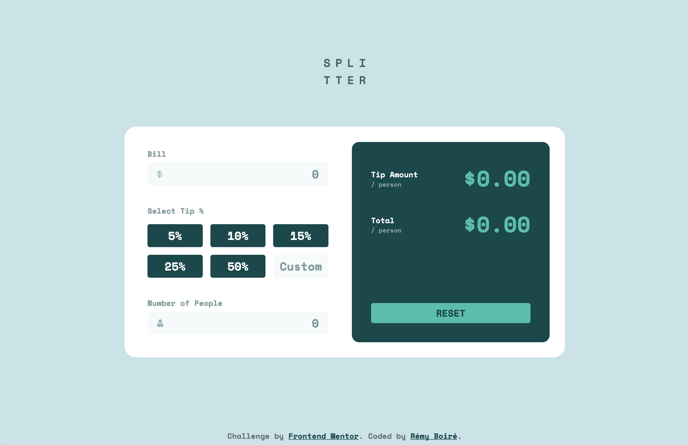

# Frontend Mentor - Tip calculator app solution

This is a solution to the [Tip calculator app challenge on Frontend Mentor](https://www.frontendmentor.io/challenges/tip-calculator-app-ugJNGbJUX). Frontend Mentor challenges help you improve your coding skills by building realistic projects.

## Table of contents

- [Overview](#overview)
  - [The challenge](#the-challenge)
  - [Screenshot](#screenshot)
  - [Links](#links)
- [My process](#my-process)
  - [Built with](#built-with)
  - [What I learned](#what-i-learned)
- [Author](#author)

## Overview

### The challenge

Users should be able to:

- View the optimal layout for the app depending on their device's screen size
- See hover states for all interactive elements on the page
- Calculate the correct tip and total cost of the bill per person

### Screenshot

### Links

- Solution URL: [Github](https://github.com/remyboire/tip-calculator-app)
- Live Site URL: [Github Pages](https://remyboire.github.io/tip-calculator-app/public)

## My process

### Built with

- Semantic HTML5 markup
- Flexbox
- CSS Grid
- Mobile-first workflow
- javascript

### What I learned

I strugglled a lot with the scss part because of the diversity of inputs and special cases. I think that my structure is far from optimal and maintenance should be hard!
Any advice on that point are welcome. I really liked the javascript part and I learned how to deal with inputs value as it was my first time.
On the inputs, I didn't manage to get the outline correctly on safari. Does anyone know the tricks?

## Author

- Website - [Rémy Boiré](https://www.remyboirefr)
- Frontend Mentor - [@yourusername](https://www.frontendmentor.io/profile/remyboire)

